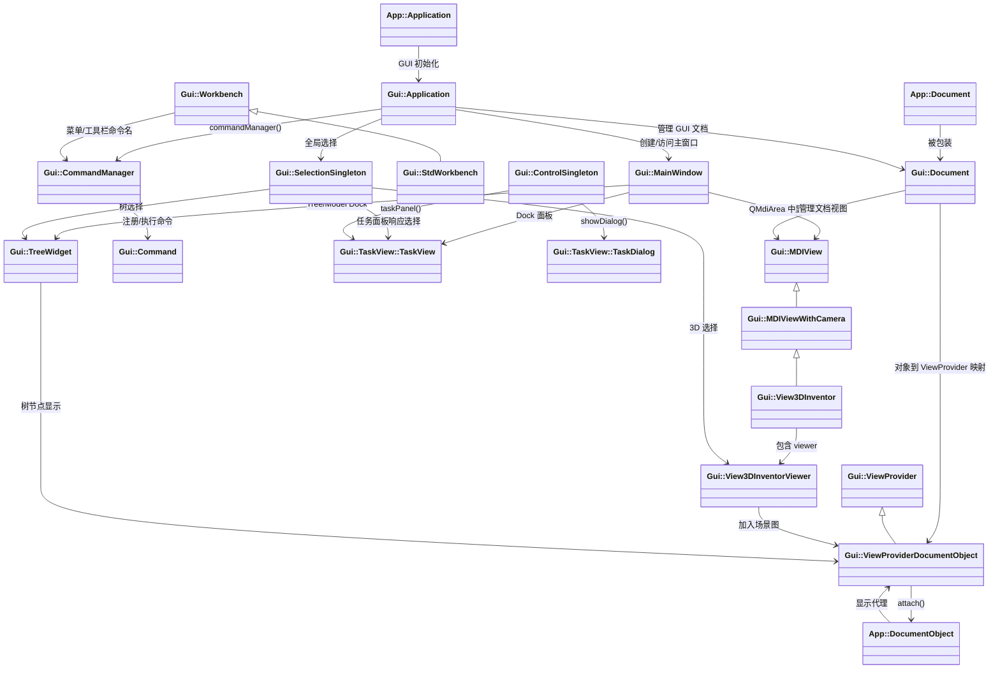
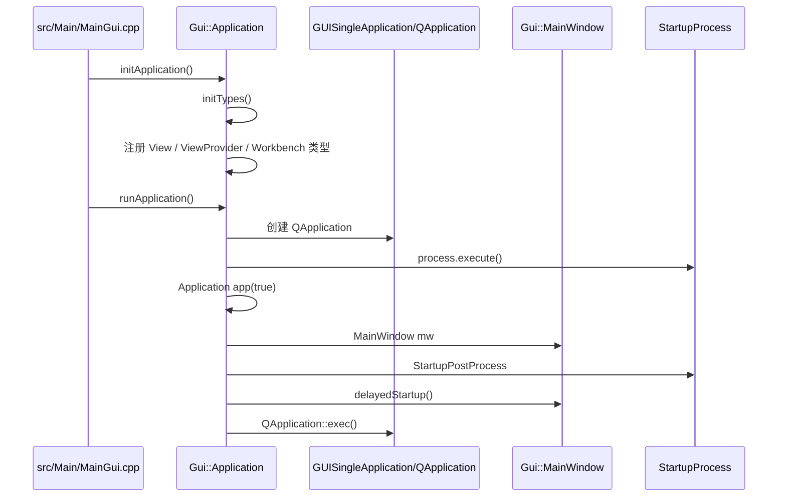
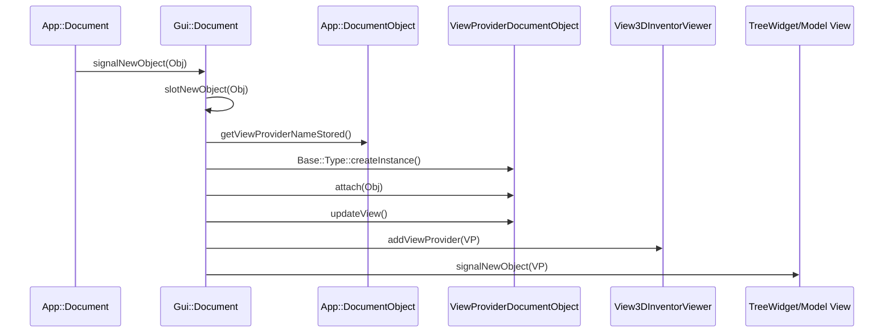
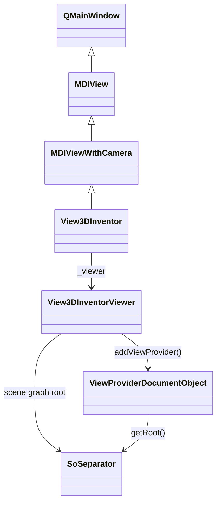
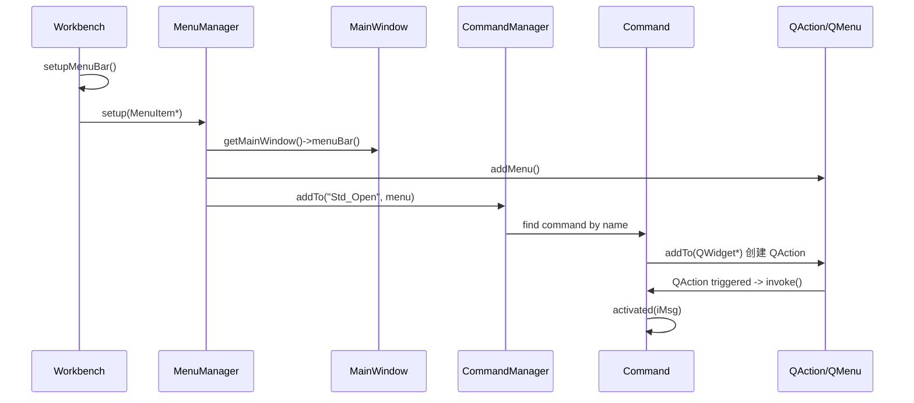
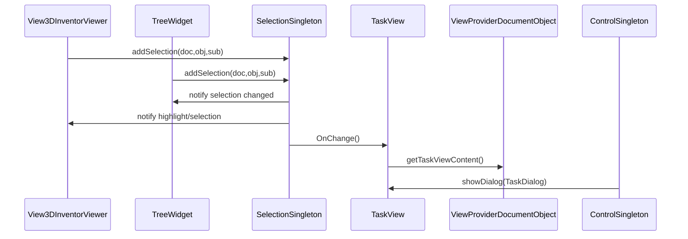
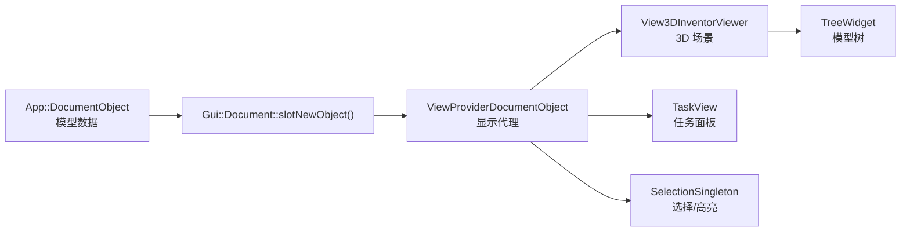

# FreeCAD GUI 相关类关系与关键代码位置

> 项目路径：`/home/aa/Desktop/McStduio`  
> 本文主要分析 `src/Gui` 与 `src/Main` 中 FreeCAD GUI 层的核心类、调用链、类关系和关键代码片段。

---

## 1. 总体理解

FreeCAD 的 GUI 层不是一个单独的窗口类完成的，而是多组类协作完成：

```text
启动入口
  ↓
Gui::Application
  ↓
MainWindow / Gui::Document / Workbench / CommandManager / SelectionSingleton
  ↓
MDIView / View3DInventor / ViewProviderDocumentObject / TaskView / TreeView
```

核心分工如下：

| 模块 | 核心类 | 作用 |
|---|---|---|
| GUI 应用核心 | `Gui::Application` | GUI 总入口，管理文档、视图、Workbench、命令、选择 |
| 主窗口 | `Gui::MainWindow` | Qt 主窗口，菜单栏、工具栏、Dock、MDI 工作区 |
| GUI 文档 | `Gui::Document` | 包装 `App::Document`，管理 ViewProvider 和视图 |
| 视图基类 | `Gui::MDIView` | 所有文档视图的基类 |
| 3D 视图 | `Gui::View3DInventor` | FreeCAD 主要 3D 窗口 |
| 3D Viewer | `Gui::View3DInventorViewer` | Coin3D / OpenGL 渲染、选择、交互 |
| 对象显示代理 | `Gui::ViewProvider` / `Gui::ViewProviderDocumentObject` | 把 `App::DocumentObject` 显示到树和 3D 视图 |
| 工作台 | `Gui::Workbench` / `Gui::StdWorkbench` | 定义菜单、工具栏、Dock |
| 命令系统 | `Gui::Command` / `Gui::CommandManager` | 把命令绑定到 QAction / 菜单 / 工具栏 |
| 选择系统 | `Gui::SelectionSingleton` | 全局选择状态，3D 视图、树、任务面板都会用 |
| 任务面板 | `Gui::TaskView::TaskView` / `TaskDialog` / `ControlSingleton` | 右侧任务面板、编辑对话框 |

---

## 2. GUI 类关系图



---

## 3. GUI 启动流程

启动入口主要在：

```text
src/Main/MainGui.cpp
```

核心调用：

```cpp
// src/Main/MainGui.cpp:256
Gui::Application::initApplication();

// src/Main/MainGui.cpp:343-344
if (inGuiMode()) {
    Gui::Application::runApplication();
}
```

`Gui::Application::initApplication()` 的实现位置：

```text
src/Gui/Application.cpp:2384
```

代码片段：

```cpp
void Application::initApplication()
{
    static bool init = false;
    if (init) {
        Base::Console().error("Tried to run Gui::Application::initApplication() twice!\n");
        return;
    }

    try {
        initTypes();
        new Base::ScriptProducer("FreeCADGuiInit", FreeCADGuiInit);
        new Base::ScriptProducer("FreeCADGuiTest", FreeCADGuiTest);
        init_resources();
        setCategoryFilterRules();
        old_qtmsg_handler = qInstallMessageHandler(messageHandler);
        init = true;
    }
    catch (...) {
        App::Application::destructObserver();
        throw;
    }
}
```

`initTypes()` 会注册 GUI 类型，包括 View、ViewProvider、Workbench：

```cpp
// src/Gui/Application.cpp:2411-2478

// views
Gui::BaseView::init();
Gui::MDIView::init();
Gui::MDIViewWithCamera::init();
Gui::View3DInventor::init();

// View Provider
Gui::ViewProvider::init();
Gui::ViewProviderDocumentObject::init();
Gui::ViewProviderFeature::init();
Gui::ViewProviderGeometryObject::init();
Gui::ViewProviderPlane::init();
Gui::ViewProviderPart::init();

// Workbench
Gui::Workbench::init();
Gui::StdWorkbench::init();
Gui::BlankWorkbench::init();
Gui::NoneWorkbench::init();
Gui::PythonBaseWorkbench::init();
Gui::PythonWorkbench::init();
```

真正创建 `QApplication`、`Gui::Application`、`MainWindow` 的地方：

```cpp
// src/Gui/Application.cpp:2658-2717

GUISingleApplication mainApp(argc, App::Application::GetARGV());

StartupProcess process;
process.execute();

Application app(true);
MainWindow mw;
mw.setProperty("QuitOnClosed", true);

StartupPostProcess postProcess(&mw, app, &mainApp);
postProcess.execute();

QTimer::singleShot(0, &mw, SLOT(delayedStartup()));

Gui::getMainWindow()->setProperty("eventLoop", true);

runEventLoop(mainApp);
```

启动流程图：



---

## 4. `Gui::Application`：GUI 总控制类

源码位置：

```text
src/Gui/Application.h
src/Gui/Application.cpp
```

类定义：

```cpp
// src/Gui/Application.h:55-69

/**
 * This is the central class of the GUI
 */
class GuiExport Application
{
public:
    explicit Application(bool GUIenabled);
    ~Application();
```

它负责视图管理：

```cpp
// src/Gui/Application.h:93-116

bool sendMsgToActiveView(const char* pMsg);
void attachView(Gui::BaseView* pcView);
void detachView(Gui::BaseView* pcView);
void viewActivated(Gui::MDIView* pcView);
void viewClosed(Gui::MDIView* pcView);
void onUpdate();
void updateActive();
void updateActions(bool delay = false);
```

也负责文档、活动视图、ViewProvider：

```cpp
// src/Gui/Application.h:182-223

Gui::Document* activeDocument() const;
void setActiveDocument(Gui::Document* pcDocument);

Gui::MDIView* activeView() const;
void activateView(const Base::Type&, bool create = false);

void showViewProvider(const App::DocumentObject*);
void hideViewProvider(const App::DocumentObject*);
Gui::ViewProvider* getViewProvider(const App::DocumentObject*) const;
```

理解：

```text
Gui::Application 是 GUI 层总管。
App::Application 管模型和文档数据；
Gui::Application 管窗口、视图、Workbench、命令、显示代理。
```

---

## 5. `MainWindow`：Qt 主窗口

源码位置：

```text
src/Gui/MainWindow.h
src/Gui/MainWindow.cpp
```

类定义：

```cpp
// src/Gui/MainWindow.h:99-132

/**
 * The MainWindow class provides a main window with menu bar, toolbars,
 * dockable windows, a status bar and mainly a workspace for the MDI windows.
 */
class GuiExport MainWindow: public QMainWindow
{
    Q_OBJECT

public:
    explicit MainWindow(QWidget* parent = nullptr, Qt::WindowFlags f = Qt::Window);

    void addWindow(MDIView* view);
```

构造函数里创建 `QMdiArea`：

```cpp
// src/Gui/MainWindow.cpp:359-423

MainWindow::MainWindow(QWidget* parent, Qt::WindowFlags f)
    : QMainWindow(parent, f)
{
    d = new MainWindowP;
    d->activeView = nullptr;

    // global access
    instance = this;

    // Create the layout containing the workspace and a tab bar
    d->mdiArea = new QMdiArea();
    d->mdiArea->setTabsMovable(true);
    d->mdiArea->setTabPosition(QTabWidget::South);
    d->mdiArea->setViewMode(QMdiArea::TabbedView);
```

添加文档视图：

```cpp
// src/Gui/MainWindow.cpp:1397-1428

void MainWindow::addWindow(MDIView* view)
{
    bool isempty = d->mdiArea->subWindowList().isEmpty();
    auto child = qobject_cast<QMdiSubWindow*>(view->parentWidget());
    if (!child) {
        child = new QMdiSubWindow(d->mdiArea->viewport());
        child->setAttribute(Qt::WA_DeleteOnClose);
        child->setWidget(view);
        child->setWindowIcon(view->windowIcon());
        d->mdiArea->addSubWindow(child);
    }

    connect(view, &MDIView::message, this, &MainWindow::showMessage);
    connect(this, &MainWindow::windowStateChanged, view, &MDIView::windowStateChanged);

    view->installEventFilter(this);
```

关系：

```text
MainWindow = Qt 主窗口
QMdiArea = 中央文档区域
MDIView = 具体文档窗口
View3DInventor = 最常见的 3D MDIView
```

---

## 6. `Gui::Document`：App 文档和 GUI 显示之间的桥

源码位置：

```text
src/Gui/Document.h
src/Gui/Document.cpp
```

类说明：

```cpp
// src/Gui/Document.h:70-78

/**
 * This is the document on GUI level.
 * Its main responsibility is keeping track off open windows for a document
 * and warning on unsaved closes.
 * All handled views on the document must inherit from MDIView.
 */
class GuiExport Document: public Base::Persistence
```

构造时连接 `App::Document` 的信号：

```cpp
// src/Gui/Document.cpp:429-467

Document::Document(App::Document* pcDocument, Application* app)
{
    d->_pcAppWnd = app;
    d->_pcDocument = pcDocument;

    d->connectNewObject = pcDocument->signalNewObject.connect(
        std::bind(&Gui::Document::slotNewObject, this, sp::_1)
    );
    d->connectDelObject = pcDocument->signalDeletedObject.connect(
        std::bind(&Gui::Document::slotDeletedObject, this, sp::_1)
    );
    d->connectCngObject = pcDocument->signalChangedObject.connect(
        std::bind(&Gui::Document::slotChangedObject, this, sp::_1, sp::_2)
    );
    d->connectRenObject = pcDocument->signalRelabelObject.connect(
        std::bind(&Gui::Document::slotRelabelObject, this, sp::_1)
    );
```

对象创建时，`Gui::Document` 会创建对应的 `ViewProviderDocumentObject`：

```cpp
// src/Gui/Document.cpp:962-1005

void Document::slotNewObject(const App::DocumentObject& Obj)
{
    auto pcProvider = static_cast<ViewProviderDocumentObject*>(getViewProvider(&Obj));
    if (!pcProvider) {
        std::string_view cName {Obj.getViewProviderNameStored()};

        Base::Type type = Base::Type::getTypeIfDerivedFrom(
            cName,
            ViewProviderDocumentObject::getClassTypeId(),
            true
        );

        pcProvider = static_cast<ViewProviderDocumentObject*>(type.createInstance());

        d->_ViewProviderMap[&Obj] = pcProvider;
        d->_CoinMap[pcProvider->getRoot()] = pcProvider;

        pcProvider->attach(const_cast<App::DocumentObject*>(&Obj));
        pcProvider->updateView();
        pcProvider->setActiveMode();
    }
```

然后加入 3D 视图和树视图：

```cpp
// src/Gui/Document.cpp:1029-1040

if (pcProvider) {
    for (auto* v : d->baseViews) {
        auto activeView = dynamic_cast<View3DInventor*>(v);
        if (activeView) {
            activeView->getViewer()->addViewProvider(pcProvider);
        }
    }

    // adding to the tree
    signalNewObject(*pcProvider);
    pcProvider->pcDocument = this;
}
```

对象创建流程图：



---

## 7. `ViewProvider`：对象显示代理

源码位置：

```text
src/Gui/ViewProvider.h
src/Gui/ViewProviderDocumentObject.h
src/Gui/ViewProviderDocumentObject.cpp
```

`ViewProvider` 是所有可视化对象的通用基类：

```cpp
// src/Gui/ViewProvider.h:198-205

/**
 * General interface for all visual stuff in FreeCAD.
 * This class is used to generate and handle all around
 * visualizing and presenting objects from the FreeCAD
 * App layer to the user.
 */
class GuiExport ViewProvider: public App::TransactionalObject
```

它持有 Coin3D 场景节点：

```cpp
// src/Gui/ViewProvider.h:222-248

virtual SoSeparator* getRoot() const
{
    return pcRoot;
}

SoSwitch* getModeSwitch() const
{
    return pcModeSwitch;
}

SoTransform* getTransformNode() const
{
    return pcTransform;
}

virtual SoSeparator* getFrontRoot() const;
virtual SoGroup* getChildRoot() const;
virtual SoSeparator* getBackRoot() const;
```

`ViewProviderDocumentObject` 是和 `App::DocumentObject` 绑定的显示代理：

```cpp
// src/Gui/ViewProviderDocumentObject.h:49-68

class GuiExport ViewProviderDocumentObject: public ViewProvider
{
public:
    App::PropertyEnumeration DisplayMode;
    App::PropertyBool Visibility;
    App::PropertyBool ShowInTree;
    App::PropertyEnumeration OnTopWhenSelected;
    App::PropertyEnumeration SelectionStyle;

    virtual void attach(App::DocumentObject* pcObject);
    virtual void reattach(App::DocumentObject*);
```

`attach()` 保存对象指针，初始化显示模式和扩展：

```cpp
// src/Gui/ViewProviderDocumentObject.cpp:368-407

void ViewProviderDocumentObject::attach(App::DocumentObject* pcObj)
{
    // save Object pointer
    pcObject = pcObj;

    // Retrieve the supported display modes of the view provider
    aDisplayModesArray = this->getDisplayModes();

    DisplayMode.setEnums(&(aDisplayEnumsArray[0]));

    if (!isRestoring()) {
        const char* defmode = this->getDefaultDisplayMode();
        if (defmode) {
            DisplayMode.setValue(defmode);
        }
    }

    auto vector = getExtensionsDerivedFromType<Gui::ViewProviderExtension>();
    for (Gui::ViewProviderExtension* ext : vector) {
        ext->extensionAttach(pcObj);
    }
}
```

理解：

```text
App::DocumentObject = 数据对象
Gui::ViewProviderDocumentObject = 这个数据对象在 GUI 里的显示代理
ViewProvider 负责：
  - 树视图显示
  - 3D 节点显示
  - 颜色/透明/显示模式
  - 选择、高亮、编辑模式
```

---

## 8. `MDIView`、`View3DInventor`、`View3DInventorViewer`

源码位置：

```text
src/Gui/MDIView.h
src/Gui/View3DInventor.h
src/Gui/View3DInventor.cpp
src/Gui/View3DInventorViewer.h
```

`MDIView` 是文档视图基类：

```cpp
// src/Gui/MDIView.h:54-70

class GuiExport MDIView: public QMainWindow, public BaseView
{
    Q_OBJECT

public:
    MDIView(Gui::Document* pcDocument, QWidget* parent, Qt::WindowFlags wflags = Qt::WindowFlags());
    ~MDIView() override;
```

`View3DInventor` 是主要 3D 视图：

```cpp
// src/Gui/View3DInventor.h:77-94

/**
 * The 3D view window
 */
class GuiExport View3DInventor: public MDIViewWithCamera
{
public:
    View3DInventor(
        Gui::Document* pcDocument,
        QWidget* parent,
        const QOpenGLWidget* sharewidget = nullptr,
        Qt::WindowFlags wflags = Qt::WindowFlags()
    );
```

构造函数里创建 `View3DInventorViewer`：

```cpp
// src/Gui/View3DInventor.cpp:95-137

View3DInventor::View3DInventor(
    Gui::Document* pcDocument,
    QWidget* parent,
    const QOpenGLWidget* sharewidget,
    Qt::WindowFlags wflags
)
    : MDIViewWithCamera(pcDocument, parent, wflags)
{
    stack = new QStackedWidget(this);
    setMouseTracking(true);
    setAcceptDrops(true);

    if (glformat) {
        _viewer = new View3DInventorViewer(f, this, sharewidget);
    }
    else {
        _viewer = new View3DInventorViewer(this, sharewidget);
    }

    _viewer->setDocument(this->_pcDocument);
    stack->addWidget(_viewer->getWidget());
    setCentralWidget(stack);
```

`View3DInventorViewer` 负责真正的 3D 渲染和选择：

```cpp
// src/Gui/View3DInventorViewer.h:105-109

/**
 * GUI view into a 3D scene provided by View3DInventor
 */
class GuiExport View3DInventorViewer:
    public Quarter::SoQTQuarterAdaptor,
    public SelectionObserver
```

关系图：



---

## 9. Workbench、菜单、工具栏、命令系统

源码位置：

```text
src/Gui/Workbench.h
src/Gui/Workbench.cpp
src/Gui/MenuManager.cpp
src/Gui/Command.h
src/Gui/Command.cpp
```

`Workbench` 定义菜单、工具栏、Dock：

```cpp
// src/Gui/Workbench.h:120-129

virtual ToolBarItem* setupCommandBars() const = 0;
virtual DockWindowItems* setupDockWindows() const = 0;
virtual void setupContextMenu(const char* recipient, MenuItem*) const;
void addPermanentMenuItems(MenuItem*) const;
```

`StdWorkbench` 定义默认菜单和工具栏：

```cpp
// src/Gui/Workbench.h:145-172

/**
 * The StdWorkbench class defines the standard menus, toolbars, commandbars etc.
 */
class GuiExport StdWorkbench: public Workbench
{
protected:
    MenuItem* setupMenuBar() const override;
    ToolBarItem* setupToolBars() const override;
    ToolBarItem* setupCommandBars() const override;
    DockWindowItems* setupDockWindows() const override;
};
```

Workbench 激活时会重新布置工具栏、Dock、菜单：

```cpp
// src/Gui/Workbench.cpp:450-476

bool Workbench::activate()
{
    ToolBarItem* tb = setupToolBars();
    setupCustomToolbars(tb, "Toolbar");
    WorkbenchManipulator::changeToolBars(tb);
    ToolBarManager::getInstance()->setup(tb);
    delete tb;

    DockWindowItems* dw = setupDockWindows();
    WorkbenchManipulator::changeDockWindows(dw);
    DockWindowManager::instance()->setup(dw);
    delete dw;

    MenuItem* mb = setupMenuBar();
    addPermanentMenuItems(mb);
    WorkbenchManipulator::changeMenuBar(mb);
    MenuManager::getInstance()->setup(mb);
    delete mb;

    setupCustomShortcuts();

    return true;
}
```

菜单最终由 `MenuManager` 渲染成 Qt 菜单栏：

```cpp
// src/Gui/MenuManager.cpp:204-224

QMenuBar* menuBar = getMainWindow()->menuBar();

menuBar->clear();

QList<QAction*> actions = menuBar->actions();
for (auto& item : menuItems->getItems()) {
    QAction* action = findAction(actions, QString::fromLatin1(item->command().c_str()));
```

菜单项如果是命令名，会交给 `CommandManager`：

```cpp
// src/Gui/MenuManager.cpp:273-307

void MenuManager::setup(MenuItem* item, QMenu* menu) const
{
    CommandManager& mgr = Application::Instance->commandManager();

    for (auto& item : item->getItems()) {
        if (item->hasItems()) {
            QMenu* submenu = menu->addMenu(
                QApplication::translate("Workbench", menuName.c_str())
            );
        }
        else {
            if (mgr.addTo(item->command().c_str(), menu)) {
                ...
            }
        }
    }
}
```

`Command` 是所有命令的基类：

```cpp
// src/Gui/Command.h:363-421

class GuiExport Command: public CommandBase
{
protected:
    explicit Command(const char* name);

    virtual void activated(int iMsg) = 0;

public:
    void invoke(int index, TriggerSource trigger = TriggerNone);
    void addTo(QWidget*);
    void initAction();
```

`CommandManager` 注册和查找命令：

```cpp
// src/Gui/Command.h:973-986

class GuiExport CommandManager
{
public:
    void addCommand(Command* pCom);
    void removeCommand(Command* pCom);

    bool addTo(const char* Name, QWidget* pcWidget);
```

实现：

```cpp
// src/Gui/Command.cpp:2041-2052

void CommandManager::addCommand(Command* pCom)
{
    auto& cmd = _sCommands[pCom->getName()];
    if (cmd) {
        return;
    }
    ++_revision;
    cmd = pCom;
    signalChanged();
}
```

```cpp
// src/Gui/Command.cpp:2103-2121

bool CommandManager::addTo(const char* Name, QWidget* pcWidget)
{
    if (_sCommands.find(Name) == _sCommands.end()) {
        Base::Console().warning("Unknown command '%s'\n", Name);
        return false;
    }
    else {
        Command* pCom = _sCommands[Name];
        pCom->addTo(pcWidget);
        return true;
    }
}
```

菜单/命令流程图：



---

## 10. Selection、Tree、TaskView 的关系

源码位置：

```text
src/Gui/Selection/Selection.h
src/Gui/Selection/Selection.cpp
src/Gui/Tree.h
src/Gui/TaskView/TaskView.h
src/Gui/TaskView/TaskDialog.h
src/Gui/Control.h
```

`SelectionSingleton` 是全局选择管理器：

```cpp
// src/Gui/Selection/Selection.h:336-349

class GuiExport SelectionSingleton: public Base::Subject<const SelectionChanges&>
{
public:
    struct SelObj
    {
        const char* DocName;
        const char* FeatName;
        const char* SubName;
        App::Document* pDoc;
        App::DocumentObject* pObject;
        App::DocumentObject* pResolvedObject;
        float x, y, z;
    };
```

选择接口：

```cpp
// src/Gui/Selection/Selection.h:351-404

bool addSelection(
    const char* pDocName,
    const char* pObjectName = nullptr,
    const char* pSubName = nullptr,
    float x = 0,
    float y = 0,
    float z = 0
);

void rmvSelection(
    const char* pDocName,
    const char* pObjectName = nullptr,
    const char* pSubName = nullptr
);

void clearSelection(const char* pDocName = nullptr, bool clearPreSelect = true);
void clearCompleteSelection(const char* pDocName = nullptr, bool clearPreSelect = true);
```

它是单例：

```cpp
// src/Gui/Selection/Selection.cpp:2451-2458

SelectionSingleton* SelectionSingleton::_pcSingleton = nullptr;

SelectionSingleton& SelectionSingleton::instance()
{
    if (!_pcSingleton) {
        _pcSingleton = new SelectionSingleton;
    }
    return *_pcSingleton;
}
```

`TreeWidget` 同时是 Qt 树和选择观察者：

```cpp
// src/Gui/Tree.h:57-60

/**
 * Tree view that allows drag & drop of document objects.
 */
class TreeWidget: public QTreeWidget, public SelectionObserver
```

`TaskView` 也监听选择变化：

```cpp
// src/Gui/TaskView/TaskView.h:158-175

/**
 * TaskView class handles the FreeCAD task view panel.
 * This elements get injected mostly by the ViewProvider classes
 * of the selected DocumentObjects.
 */
class GuiExport TaskView:
    public QStackedWidget,
    public Gui::SelectionSingleton::ObserverType
{
public:
    void OnChange(
        Gui::SelectionSingleton::SubjectType& rCaller,
        Gui::SelectionSingleton::MessageType Reason
    ) override;
```

`ControlSingleton` 控制任务面板对话框：

```cpp
// src/Gui/Control.h:54-77

class GuiExport ControlSingleton: public QObject
{
public:
    static ControlSingleton& instance();

    void showDialog(Gui::TaskView::TaskDialog* dlg, App::Document* attachTo = nullptr);
    Gui::TaskView::TaskDialog* activeDialog(App::Document* attachedTo = nullptr) const;

    Gui::TaskView::TaskView* taskPanel() const;
    void showModelView();
```

选择和任务面板流程图：



---

## 11. Dock、ComboView、Model/Task 面板

Dock 管理类：

```text
src/Gui/DockWindowManager.h
```

```cpp
// src/Gui/DockWindowManager.h:75-94

class GuiExport DockWindowManager: public QObject
{
public:
    static DockWindowManager* instance();

    bool registerDockWindow(const char* name, QWidget* widget);
    QWidget* unregisterDockWindow(const char* name);
    QWidget* findRegisteredDockWindow(const char* name);
    void setup(DockWindowItems*);

    QDockWidget* addDockWindow(
        const char* name,
        QWidget* widget,
        Qt::DockWidgetArea pos = Qt::AllDockWidgetAreas
    );
```

左侧常见的 Model/Task 组合面板是 `ComboView`：

```text
src/Gui/ComboView.h
```

```cpp
// src/Gui/ComboView.h:62-90

/**
 * Combo View is a combination of a tree and property view.
 */
class GuiExport ComboView: public Gui::DockWindow
{
public:
    ComboView(Gui::Document* pcDocument, QWidget* parent = nullptr);

private:
    Gui::PropertyView* prop;
    Gui::TreePanel* tree;
};
```

---

## 12. 最重要的源码位置清单

| 目标 | 文件 | 重点 |
|---|---|---|
| GUI 启动入口 | `src/Main/MainGui.cpp` | 调用 `Gui::Application::initApplication()` 和 `runApplication()` |
| GUI 总控 | `src/Gui/Application.h/.cpp` | 管理文档、视图、Workbench、命令、选择 |
| 主窗口 | `src/Gui/MainWindow.h/.cpp` | `QMainWindow`、`QMdiArea`、菜单栏、Dock、状态栏 |
| GUI 文档 | `src/Gui/Document.h/.cpp` | `App::Document` 到 `Gui::Document`，创建 ViewProvider |
| ViewProvider 基类 | `src/Gui/ViewProvider.h` | Coin3D 节点、显示代理基类 |
| 文档对象 ViewProvider | `src/Gui/ViewProviderDocumentObject.h/.cpp` | 绑定 `App::DocumentObject` |
| MDI 视图基类 | `src/Gui/MDIView.h/.cpp` | 所有文档视图基类 |
| 3D 视图窗口 | `src/Gui/View3DInventor.h/.cpp` | 3D MDIView |
| 3D Viewer | `src/Gui/View3DInventorViewer.h/.cpp` | OpenGL/Coin3D/选择/交互 |
| Workbench | `src/Gui/Workbench.h/.cpp` | 菜单、工具栏、Dock 定义 |
| 菜单管理 | `src/Gui/MenuManager.cpp` | `MenuItem` 到 `QMenuBar/QMenu/QAction` |
| 工具栏管理 | `src/Gui/ToolBarManager.*` | 工具栏生成 |
| Dock 管理 | `src/Gui/DockWindowManager.*` | Dock 面板管理 |
| 命令系统 | `src/Gui/Command.h/.cpp` | `Command`、`CommandManager` |
| 标准命令 | `src/Gui/Command*.cpp` | `Std_New`、`Std_Open` 等命令实现 |
| 选择系统 | `src/Gui/Selection/Selection.h/.cpp` | 全局选择 |
| 树视图 | `src/Gui/Tree.h/.cpp` | Model tree、对象树 |
| 任务面板 | `src/Gui/TaskView/TaskView.h/.cpp` | Task 面板 |
| TaskDialog | `src/Gui/TaskView/TaskDialog.h/.cpp` | 参数编辑面板 |
| 控制任务面板 | `src/Gui/Control.h/.cpp` | `Gui::Control().showDialog(...)` |

---

## 13. 一句话总结

```text
App 层负责数据：
    App::Document / App::DocumentObject

Gui 层负责显示：
    Gui::Document / Gui::ViewProviderDocumentObject

窗口层负责承载：
    MainWindow / MDIView / View3DInventor

渲染层负责 3D：
    View3DInventorViewer / Coin3D SoNode

交互层负责命令和选择：
    Workbench / CommandManager / SelectionSingleton / TaskView
```

最关键的一条链路：



后续二次开发时，一般按下面规律找代码：

```text
改主窗口布局       → MainWindow.cpp
改菜单/工具栏      → Workbench.cpp / MenuManager.cpp / ToolBarManager.cpp
改命令按钮功能     → Command*.cpp
改对象显示         → ViewProvider*.cpp
改 3D 交互         → View3DInventorViewer.cpp / Selection
改左侧树/属性面板  → Tree.cpp / PropertyView / ComboView
改任务面板         → TaskView / TaskDialog / Control
```

---

## 14. 常用检索命令

在项目根目录执行：

```bash
cd /home/aa/Desktop/McStduio

rg -n "initApplication\(" src
rg -n "class GuiExport Application" src/Gui/Application.h
rg -n "class GuiExport MainWindow" src/Gui/MainWindow.h
rg -n "class GuiExport Document" src/Gui/Document.h
rg -n "slotNewObject" src/Gui/Document.cpp
rg -n "class GuiExport ViewProvider" src/Gui/ViewProvider.h
rg -n "class GuiExport ViewProviderDocumentObject" src/Gui/ViewProviderDocumentObject.h
rg -n "class GuiExport MDIView" src/Gui/MDIView.h
rg -n "class GuiExport View3DInventor" src/Gui/View3DInventor.h
rg -n "class GuiExport View3DInventorViewer" src/Gui/View3DInventorViewer.h
rg -n "class GuiExport Workbench" src/Gui/Workbench.h
rg -n "Workbench::activate" src/Gui/Workbench.cpp
rg -n "class GuiExport Command" src/Gui/Command.h
rg -n "CommandManager::addCommand|CommandManager::addTo" src/Gui/Command.cpp
rg -n "class GuiExport SelectionSingleton" src/Gui/Selection/Selection.h
rg -n "class GuiExport TaskView" src/Gui/TaskView/TaskView.h
```
